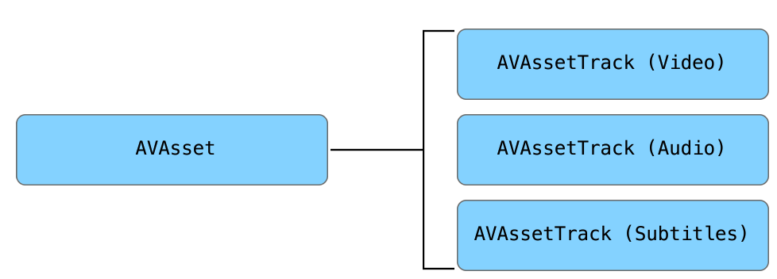
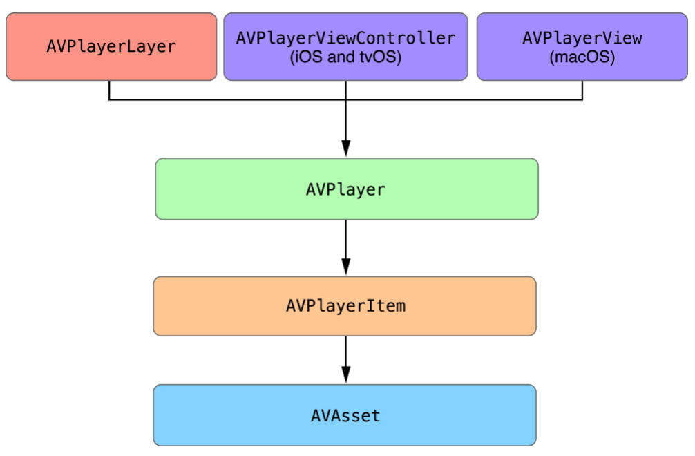

# iOS_Player_UsingAVPlayer
 How to use AVPlayer and How this is organized
These git repository is iOS Media Player using AVPlayer Sample
Explain about AVPlayer and How to use it!!

## AVKit and AVFoundation
 Both are used to deal with Media Process

### AVFoundation
 **AVFoundation** provides multiple media processor(ex] editing and media capture etc....)
If u are using AVFoundation u can deal with video, audio, HLS etc ...
**AVFoundation** provides also metadatas like title of media, keyword, subtitle etc...
and functions about playback media like real time process

 **AVFoundation** provides a lot of functions about media But they can't provide standard UI because AVFoundation is low-level tech

### AVKit
 **AVKit** is easier than AVFoundation
If u use AVKit, Easy to make interface

### AVAsset
 Main Function of AVFoundation is managing of asset and playback asset
**AVAsset** is a container of static information about Media Data
**AVAsset** can translate to URL object from local file based media data, remote media data and Live Streaming
**AVAsset** is consist of **AVAssetTrack**
AVAsset can access these AVAssetTracks

#### Creating AVAsset
 AVAsset is abstract class so Generate **AVURLAsset** which inherited AVAsset Class

### MetaData
 Metadata has a lot of different formats
But Don't worry about, **AVFoundation provides AVMetaataItem class which can deal with various format metadatas**

### Playback Media
#### AVPlayer
 AVPlayer manage playback of Assets
#### AVPlayerItem
 AVPlayerItem manage Asset's Presentation State
#### AVPlayerItemTrack
 AVPlayerItemTrack manage Presentation State about each of track in Asset 
### AVPlayerLayer
 AVPlayerLayer can print out media on screen

